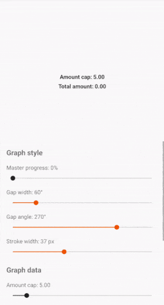

# Donut

[ ](https://bintray.com/thefuntastyops/donut/donut/_latestVersion)
[](https://github.com/futuredapp/donut/actions)
[](https://android-arsenal.com/details/1/8015)


Donut is an Android library which helps you to easily create beautiful doughnut-like charts.

## Installation

`module/build.gradle`:

```groovy
dependencies {
    implementation("app.futured.donut:library:$version")
}
```

## Features

`DonutProgressView` is a configurable doughnut-like chart view capable of displaying multiple sections with assignable colors. It supports animations and features a gap at the top, which makes it look like a gauge (or tasty bitten-off donut - that's why the name).


The view automatically scales it's sections proportionally to their values once it gets filled up. This allows you to show your users their daily progresses, reached goals, etc.

## Usage

Place the view in your layout

```xml
<app.futured.donut.DonutProgressView
    android:id="@+id/donut_view"
    android:layout_width="wrap_content"
    android:layout_height="wrap_content"
    app:donut_bgLineColor="@color/cloud"
    app:donut_gapWidth="20"
    app:donut_gapAngle="270"
    app:donut_strokeWidth="16dp"/>
```

Submit data to the view

```kotlin
val section1 = DonutSection(
    name = "section_1",
    color = Color.parseColor("#FB1D32"),
    amount = 1f
)

val section2 = DonutSection(
    name = "section_2",
    color = Color.parseColor("#FFB98E"),
    amount = 1f
)

donut_view.cap = 5f
donut_view.submitData(listOf(section1, section2))
```

You'll get something like this:


### About the data cap

Once the sum of all section values exceeds view's `cap` property, the view starts to scale it's sections proportionally to their amounts along it's length. E.g. if we, in the upper example, set cap to `donut_view.cap = 1f` (`section1.amount + section2.amount > 1f`), we would get something like this:


### Submitting data

The view accepts list of `DonutSection` objects that define data to be displayed.
Each `DonutSection` object holds section's unique name (string), it's color (color int) and section's value. *(Note: the view uses unique name for each section to resolve it's internal state and animations, and throws `IllegalStateException` if multiple sections with same name are submitted.)*

```kotlin
val waterAmount = DonutSection(
    name = "drink_amount_water",
    color = Color.parseColor("#03BFFA"),
    amount = 1.2f
)
```

You have to submit new list of sections everytime you want to modify displayed data, as `DonutSection` object is immutable.

```kotlin
donut_view.submitData(listOf(waterAmount))
```

#### Granular controls

The view also provides methods for more granular control over displayed data. You can use `addAmount`, `setAmount` and `removeAmount` methods to add, set or remove specified amounts from displayed sections.

##### Adding amount

```kotlin
donut_view.addAmount(
    sectionName = "drink_amount_water",
    amount = 0.5f,
    color = Color.parseColor("#03BFFA") // Optional, pass color if you want to create new section
)
```

The `addAmount` adds specified amount to section with provided name. What if section does not yet exist? This method has one optional `color` parameter (default value is `null`) - when called, and there isn't already displayed any section with provided name and `color` parameter was specified, the new `DonutSection` with provided name, amount and color will be automatically created internally for you. If you leave the `color` param `null` while trying to add value to non-existent section, nothing happens.

##### Setting amount

```kotlin
donut_view.setAmount(
    sectionName = "drink_amount_water",
    amount = 2.5f
)
```

The `setAmount` methods sets specified amount to section with provided name. If provided amount is equal or less than 0, section and corresponding progress line are automatically removed after animation. If view does not contain specified section, nothing happens.

##### Removing amount

```kotlin
donut_view.removeAmount(
    sectionName = "drink_amount_water",
    amount = 0.1f
)
```

The `removeAmount` simply subtracts specified amount from any displayed section. If resulting amount is equal or less than 0, section and corresponding progress line are automatically removed after animation. If view does not contain specified section, nothing happens.

#### Get and clear data

If you want to get currently displayed data, call `getData()` method which returns immutable list of all displayed `DonutSection` objects. To clear displayed data, call `clear()` method.

Each call to a data method (submit, add, set, remove, clear) results in view **automatically resolving and animating to the new state**.

### Customization

The view allows you to configure various properties to let you create a unique style that fits your needs. They can be changed either via XML attributes, or at runtime via property access.

#### XML attributes

|Name|Default value|Description|
|---|---|---|
| `donut_cap`| `1.0f` | View's cap property |
| `donut_strokeWidth` | `12dp` | Width of background and section lines in dp |
| `donut_bgLineColor`| `#e7e8e9` | Color of background line |
| `donut_gapWidth` | `45°` | Width of the line gap in degrees |
| `donut_gapAngle` | `90°` | Position of the line gap around the view in degrees |
| `donut_animateChanges` | `true` | Animation enabled flag, if `true`, the view will animate it's state changes (enabled by default) |
| `donut_animationInterpolator` | `DecelerateInterpolator` | Interpolator to be used in state change animations |
| `donut_animationDuration` | `1000 ms` | Duration of state change animations in ms |

In addition to these XML attributes, the view features `masterProgress` property (`0f to 1f`) that can be changed programatically. It controls percentual progress of all lines, including the background line, which allows you to get creative with startup animations, etc.

#### Sample app

The quickest way to explore different styles is to try the [sample](sample/) app, which contains an interactive playground with buttons and sliders to fiddle with.



## Contributors

Current maintainer and main contributor is [Matej Semančík](https://github.com/matejsemancik).

## Licence

Donut is available under MIT license. See [LICENSE file](LICENSE) for more information.
