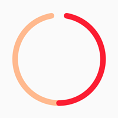

[  ](https://bintray.com/thefuntastyops/donut/donut/_latestVersion)
[](https://app.bitrise.io/app/e9f4fbbcc143c212)

# Donut 🍩
`DonutProgressView` is a configurable doughnut-like graph view capable of displaying multiple datasets with assignable colors. It features a gap at the top, which makes it look like a gauge (or tasty bitten-off donut - that's why the name).


The view uses a `cap` property to determine when it should start to proportionally scale it's datasets once their sum gets above it.

## Usage
Placing the view in your layout

```xml
<app.futured.donut.DonutProgressView
    android:id="@+id/donut_view"
    android:layout_width="wrap_content"
    android:layout_height="wrap_content"
    app:donut_bgLineColor="@color/cloud"
    app:donut_gapWidth="20"
    app:donut_gapAngle="270"
    app:donut_strokeWidth="8dp"/>
```

and submitting data to the view

```kotlin
val dataset1 = DonutDataset(
    name = "dataset_1",
    color = Color.parseColor("#FB1D32"),
    amount = 1f
)

val dataset2 = DonutDataset(
    name = "dataset_2",
    color = Color.parseColor("#FFB98E"),
    amount = 1f
)

donut_view.cap = 5f
donut_view.submitData(listOf(dataset1, dataset2))
```

would look like this:


Once the sum of all dataset values exceeds view's `cap` property, the view starts to scale it's datasets proportionally to their amounts along the full length. E.g. if we, in the upper example, set cap to `donut_view.cap = 1f` (`dataset1.amount + dataset2.amount > 1f`), we would get something like this



### Customization
You can use various view properties to define it's appearance and behavior.  
TBD

## Download
`build.gradle`:

```groovy
allprojects {
    repositories {
        jcenter()
    }
}
```

`module/build.gradle`:

```groovy
dependencies {
    implementation("app.futured.donut:library:$version")
}
```
