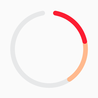

[ ](https://bintray.com/thefuntastyops/donut/donut/_latestVersion)
[](https://app.bitrise.io/app/e9f4fbbcc143c212)

# Donut 🍩
`DonutProgressView` is a configurable doughnut-like graph view capable of displaying multiple datasets with assignable colors. It supports animations and features a gap at the top, which makes it look like a gauge (or tasty bitten-off donut - that's why the name).


It's signature feature is that the view automatically scales it's data proportionally to their values once it gets filled up. This allows you to show your users their daily progresses, reached goals, etc.  

## How to use
Place the view in your layout

```xml
<app.futured.donut.DonutProgressView
    android:id="@+id/donut_view"
    android:layout_width="wrap_content"
    android:layout_height="wrap_content"
    app:donut_bgLineColor="@color/cloud"
    app:donut_gapWidth="20"
    app:donut_gapAngle="270"
    app:donut_strokeWidth="8dp"/>
```

Submit data to the view

```kotlin
val dataset1 = DonutDataset(
    name = "dataset_1",
    color = Color.parseColor("#FB1D32"),
    amount = 1f
)

val dataset2 = DonutDataset(
    name = "dataset_2",
    color = Color.parseColor("#FFB98E"),
    amount = 1f
)

donut_view.cap = 5f
donut_view.submitData(listOf(dataset1, dataset2))
```

This will get you this:



### About the data cap
Once the sum of all dataset values exceeds view's `cap` property, the view starts to scale it's datasets proportionally to their amounts along the full length. E.g. if we, in the upper example, set cap to `donut_view.cap = 1f` (`dataset1.amount + dataset2.amount > 1f`), we would get something like this:


## Submitting data
The view accepts list of `DonutDataset` objects that define data to be displayed.  
Each `DonutDataset` object holds dataset's unique identifier (string), it's color (color int) and dataset's value. *(Note: the view uses unique ID to resolve it's internal state and animations, and has undefined behavior if more datasets with the same ID are provided)*


You have to submit new list of datasets everytime you want to modify displayed data, as `DonutDataset` object is immutable.


The target use-case is: You observe data source, which emits new data on change (eg. database) → you map the data to list of dataset objects → you bind these datasets to the view *(Note: binding adapters are coming in future releases)* → **view automatically resolves (and animates) to new state**.

## Customization
You can use various view properties to define it's appearance and behavior.  
TBD

## Download
`build.gradle`:

```groovy
allprojects {
    repositories {
        jcenter()
    }
}
```

`module/build.gradle`:

```groovy
dependencies {
    implementation("app.futured.donut:library:$version")
}
```
